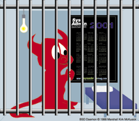
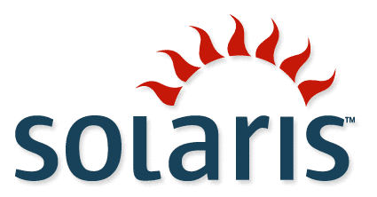
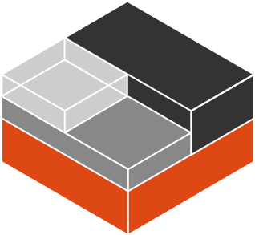
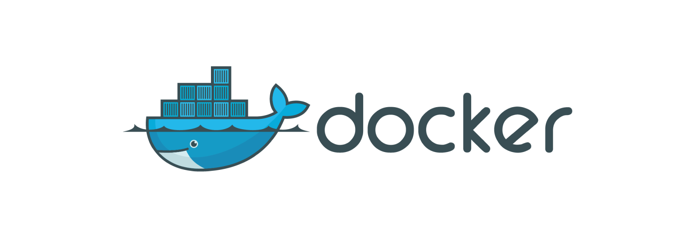

# Orixes dos contedores de software

> Vamos a revisar unha serie de ferramentas e tecnoloxías que xurdiron ao longo dos anos en diferentes sistemas operativos, para dar resposta ao problema que se plantexaba no módulo 1 sobre a xestión de recursos dentro dun SO.

---

## **Xaulas chroot (1979)**


No desenrolo do sistema Unix V7, agregouse unha nova chamada de sistema (chroot) que permitía cambiar o directorio raíz dun proceso, e os seus descendentes, a unha nova localización do sistema de ficheiros.

Este avance foi o comezo do illamento a nivel de proceso, posibilitando controlar o acceso aos ficheiros por proceso. 

Na actualidade esa ferramenta aínda está dispoñible en calquer sistema Unix , e por suposto en Linux. Podedes probala seguindo o seguinte exemplo:

```shell
# copiamos los binarios que queremos executar na xaula chroot
mkdir -p chroot/bin
sudo cp /bin/{ls,bash,mkdir,rm} chroot/bin/
sudo cp /usr/bin/tree chroot/bin/
```

```shell
# montamos librerias
mkdir chroot/{lib,lib64}
for i in {lib,lib64}; do sudo mount --bind /$i chroot/$i ; done
```

```shell
# chroot
sudo chroot chroot/
```

```shell
# probamos a executar estos comandos básicos de unix
ls
tree -d -L 2
mkdir /probando
```

```shell
# desmontamos
for i in {lib,lib64}; do sudo umount chroot/$i ; done
```

---

## **FreeBSD Jails (2000), Solaris Zones (2004)**




Duas décadas despois, un proveedor de hosting sacou un servizo sobre xaulas BSD para lograr unha separación de recursos clara entre os seus servizos e os dos seus clientes, e deste xeito mellorar a seguridade e facilitar a administración dos mesmos.

As xaulas de FreeBSD permiten a un administrador, particionar un sistema FreeBSD en varios sistemas BSD independentes e con menos recursos, illados, e coa capacidade de agregar unha IP a cada un deles.

Oracle agregou unha característica similar a Solaris, que combina o control de recursos que pode consumir un proceso, ca separación en zonas dos procesos que se executan na máquina.

---

## **OpenVZ (2005)**


Un ano máis tarde, a compañía Virtuozzo creou un novo sistema de virtualización basado en contedores, sobre o kernel de Linux, que permitía crear multiples contedores illados e seguros, nunha mesma máquina, como se dun servidor privado virtual se tratara.

O código de OpenVZ, aínda que está aberto, nunca formou parte da distribución oficial do kernel de Linux e se incorpora como unha serie de parches extra que se aplican sobre o código do kernel.

---

## **linuxcontainers (2008) e Docker (2013)**




A primeira ferramenta de contedores de software que encontrou ampla acollida dentro da comunidade de Linux foi [LXC](https://linuxcontainers.org/), principalmente polas tecnoloxías que aglutinaba e que foron introducidas dentro do kernel de linux (**Namespaces e cgroups**).

O seu obxectivo e dispor dun contedor como un entorno o máis similar posible a unha máquina virtual, pero sen o sobrecoste de emular hardware.

A xestión de este contedor se fai mediante unha serie de ficheiros de configuración, donde o usuario ten que encargarse de descargar e preparar o sistema de ficheiros, e definir e configurar os namespaces onde quere conectar ao container, conectar a rede ... o que o convirte en unha ferramenta moi pouco amigable para un desenvolvedor.

A compañía dotCloud, onde traballaban os creadores de Docker, e que empregaba LXC para proporciona aos seus clientes un dos primeiros [servizos de aloxamento PaaS](https://azure.microsoft.com/es-es/overview/what-is-paas/) que apareceu no mercado, buscando unha forma de facilitar a adopción do seu servizo, e trantando de facer máis accesible a tecnoloxía de contedores aos desenvolvedores de aplicacións, creou o proxecto que sería o precursor de Docker.

Docker se libera como proxecto de [código aberto](https://github.com/moby/moby) o 13 de marzo de 2013, e na actualidade a pesar do cambio de estratexia e de nome, ten máis de 50.000 estrelas en Github e casi 2.000 contribuidores, e convertiuse na principal tecnoloxía para a xestión de contedores.

* **Saber máis**

 - [A brief history of containers](https://blog.aquasec.com/a-brief-history-of-containers-from-1970s-chroot-to-docker-2016)

 - [Confining the omnipotent root](http://phk.freebsd.dk/pubs/sane2000-jail.pdf)
