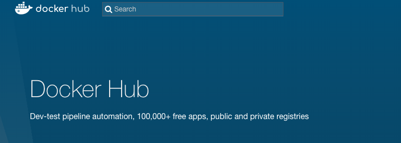

# O Dockerhub

## Que é?

> O dockerhub é un repositorio público e gratuito de imaxes de Docker. 

Tanto desenvolvedores oficiais de software como empresas e aficionados ofrecen o seu **software** configurado e con **tódalas dependencias necesarias** empaquetadas en imaxes que calqueira persona pode empregar de forma totalmente gratuita. Basta escoller unha imaxe e descargala para poder empregar o software da nosa escolla sen necesidade de instalar nada, sen configuracións e, sobre todo, sen preocuparse de dependencias. 

## Como buscamos imaxes?

> Basta con ir ó portal de dockerhub, e introducir no caxetín de búsqueda o nome do software da nosa escolla:

Se probamos a introducir a palabra "**nginx**", veremos unha serie de resultados:

Como podemos ver, o Dockerhub categoriza as imaxes expoñendo unha serie de datos sobre elas:

- Nome
- Autor
- Puntuación
- Número de descargas da imaxe
- Categoría da imaxe

Dockerhub categoriza as imaxes da seguinte forma:

- **Official**: imaxes creadas polos desenvolvedores do software específico da imaxe. 
- **Public**: imaxes a empregar de forma gratuita por calquiera persona. 
- **Automated Build**: imaxes conectadas a repositorios de código (BitBucket, Github) que presentan unha xeración automática segundo determinadas condicións (ex. un commit ou merge na rama máster do proxecto).
