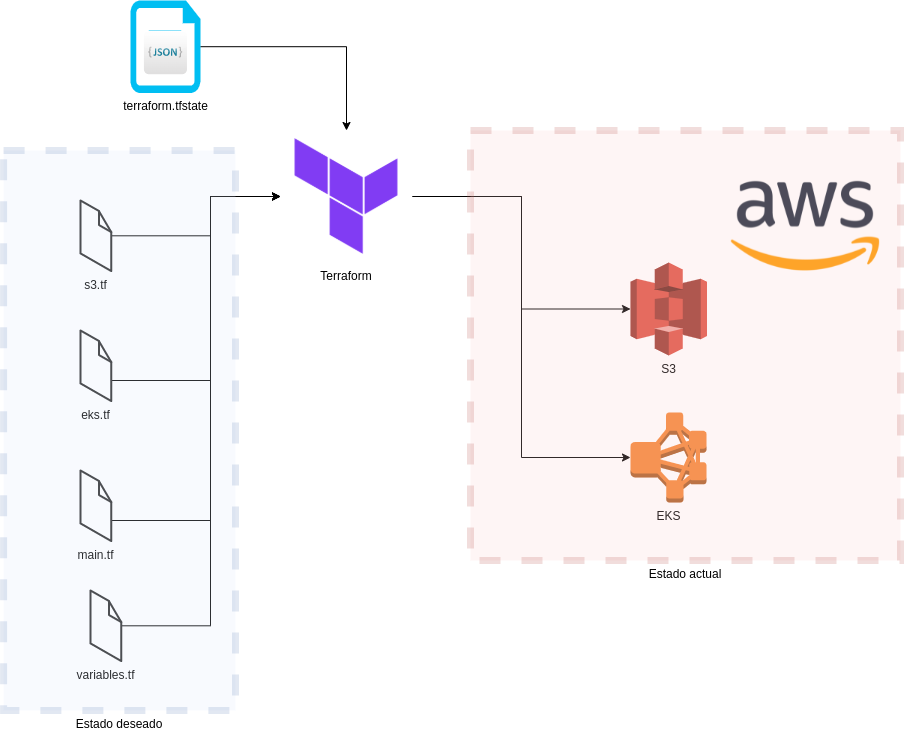

# Estados en terraform

Terraform debe almacenar o estado da súa infraestructura e configuración administradas. Éste estado utilízase para asignar recursos do mundo real e a súa configuración.

O estado almacénase de forma predeterminada nun archivo local chamado "terraform.tfstate", pero tamén pódese almacenar de forma remota, o cal é ideal nun entorno formado por varias persoas.

Terraform utiliza este estado local para crear plans e realizar cambios na infraestructura. Antes de calquer operación, Terraform realiza un chequeo para actualizar este estado co da infraestructura real.

Como podemos ver neste exemplo, temos declarados unha serie de artefactos que pertenecen a infraestructura que nos proporciona AWS (Amazon Web Services). Neste caso temos un Amazon S3 (Amazon Simple Storage Service) que é un servicio de almacenamiento de obxetos deste proveedor. Con Terraform podemos declarar que queremos isto na nosa infraestructura. O mesmo ocorre co EKS (Elastic Kubernetes Service), que é outro servicio de Amazon, neste caso é un servicio para executar e escalar kubernetes na nube.
